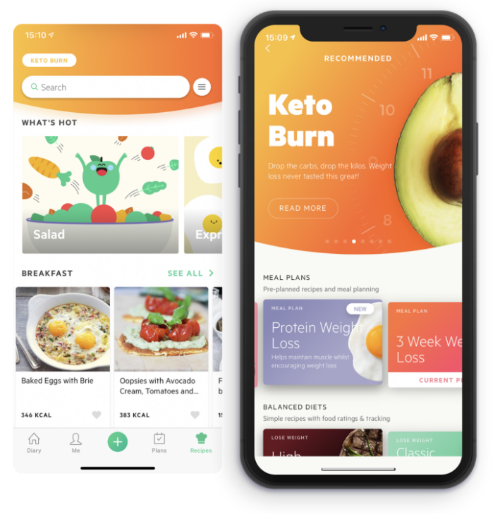
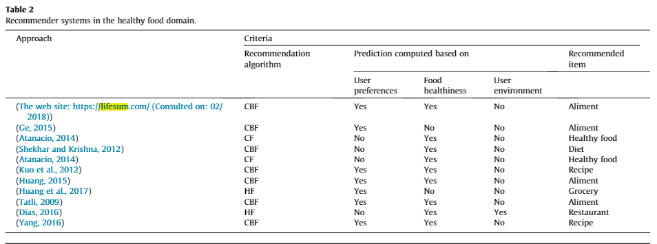
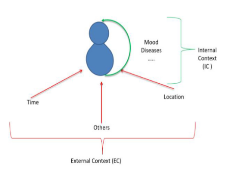

### Task

**Your task is to analyze an existing recommended system that you find interesting. ** 

You should:

**Perform a Scenario Design analysis**
Consider whether it makes sense for your selected recommender system to perform scenario design twice, once for the organization (e.g. Amazon.com) and once for the organization's customers.

**Reverse engineer**
from the site interface and any available information that you can find on the Internet or elsewhere.

**Improvement Recommendations**
Include specific recommendations about how to improve the site's recommendation capabilities going forward. 

Create your report using an R Markdown file, and create a discussion thread with a link to the GitHub repo where your Markdown file notebook resides.  You are not expected to need to write code for this discussion assignment.

## LIFESUM
__________________________________________________

**Lifesum**
Both Lifesum and MyFitnessPal help you track calories and keep a food diary while also tracking water intake. They each have up-to-date technologies, including integration with other exercise apps and barcode scanning technology to quickly find food in their databases.

### Scenario Analysis

1.- **Who are the target audience:** 
Lifesum’s simple design is targeted towards people looking to try health tracking for the first time and have little experience with recording diet and exercise

The typical user of a diet app is young. As of 2017, 17% of 30- to 45-year-olds and 26% of 18- to 29-year-olds regularly use apps to track their diet and nutrition. [Source - Statista.com](https://www.statista.com/statistics/1076508/most-popular-new-year-s-resolutions-in-the-united-states/)

2.- **What is the key goals:** 
allows users to count calories, create personalized diet plans, monitor daily healthy habits, get meal suggestions, track macros, obtain more detailed information about their weight, body fat, waist size, and BMI, and receive tips and feedback on how to improve over time and develop healthier eating habits

**The main overall end goal for the LIfesum app is not
just to lose weight, but rather to create a sustainable
healthy lifestyle**

3.- **How can you help them to accomplish these goals:** 
Incorporate communication with other databases or applications that help the user understand himself better. Perhaps learning the users ethnicity, genetical information, history of illness in the family and last performed blood, hormone and stool samples.

### Reverse Ingeneer

**Healthy food recommender system** 

**Content-based Filtering**

Food recommendation system uses a content-based recommendation technique to produce dietary recommendations. It is based on the similarity of the foods. Basically, the system constructs user profiles from the previously evaluated characteristics and food profiles from the ingredients of the food, and then recommends the most appropriate foods according to the user’s preferences.
[Source](https://www.sciencedirect.com/science/article/pii/S1319157820303475#b0170)

### Recommendations

Lifesum DOES NOT considers user preferences, food health-iness and user environment all together to compute the prediction.

Two dimensions contextual collaborative recommender system (2DCCRS)

In order to provide a new solution to assist people who suffer from chronic diseases and/or, without any nutritional knowledge, as well as people who are not ill but they have a health concern or mental illness or special need (autism, down syndrome etc.)

A new approach will need to be implemented taking into consideration things like:

General information about this user (such as gender, age,weight...etc.).
- The state of health of the user

- The eating habits of the user (vegetarian, Hallal).

- The physical activity of the user (if he practices sports or not).

- The food preferences of the user.

- The influence of the external environment of the user, where he is positioned (time, temperature and its environmental factors,etc.)

- The family history of disease

- Recent blood tests indicating lack of vitamins or minerals in their system.

